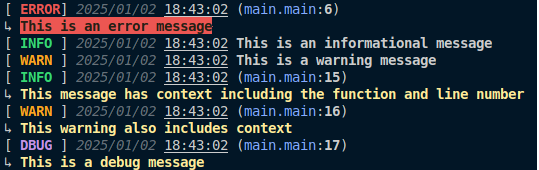

# Logger - A Flexible Logging Package for Go

`logger` is a versatile logging package for Go that supports both direct logging and configured logging with email reporting capabilities. It provides various logging levels and can be used either as a standalone package or as a dependency with additional features.

## Features

- **Multiple Logging Levels**: Error, Info, Warn, Debug, and Alert
- **Contextual Logging**: Function name and line number tracking
- **Colorized Output**: Enhanced visibility with color-coded log levels
- **Email Reporting**: Configurable email delivery of log batches
- **Immediate Alerts**: Instant notification for critical issues
- **Smart Caching**: Efficient log management with empty cache detection
- **Thread-Safe**: Safe for concurrent use
- **Flexible Configuration**: Customize logging behavior and delivery options
- **Coming Soon**:
  - HTTP webhook support
  - File system logging

## Examples



## Installation

```bash
go get github.com/pecet3/logger
```

## Usage Modes

### Direct Usage

Use the package-level functions for simple logging:

```go
package main

import "github.com/pecet3/logger"

func main() {
    // Basic logging
    logger.Info("This is an informational message")
    logger.Warn("This is a warning message")
    logger.Debug("This is a debug message")

    // Context-aware logging (includes function name and line number)
	/home/pc/projects/go/quizexx/backend/pkg/loggerlogger.Error("This is an error message")
    logger.InfoC("This message includes caller context")
    logger.WarnC("This warning includes caller context")
}
```

### Configured Usage with Email Reporting and Alerts

Create a configured logger instance with email capabilities:

```go
package main

import (
    "github.com/pecet3/logger"
    "time"
)

func main() {
    // Configure email settings
    emailConfig := &logger.Email{
        SMTPHost:      "smtp.example.com",
        SMTPPort:      587,
        Username:      "your-email@example.com",
        Password:      "your-password",
        FromAddress:   "sender@example.com",
        ToAddresses:   []string{"recipient@example.com"},
        SubjectRaport: "Log Report",
        SubjectAlert:  "Log Alert",
    }

    // Create logger configuration
    config := &logger.Config{
        IsDebugMode: true,
        Email:       emailConfig,
        Duration:    time.Minute * 30, // Send logs every 30 minutes
    }

    // Initialize the logger
    log := logger.New(config)

    // Regular logging
 	log.Error("This error will be logged and emailed")
    log.Info("This info message will be collected")
    log.Warn("This warning will be included in the report")
    log.Debug("Debug message with caller information")
    log.InfoC("Info with context")
    log.WarnC("Warning with context")

    // Immediate alert
    log.Alert("Critical issue detected!") // This will trigger immediate notification
}
```

## Log Levels

- **Alert**: Critical issues requiring immediate attention (triggers instant notification)
- **Error**: Serious issues that need attention
- **Info**: General information about application operation
- **Warn**: Warning messages for potential issues
- **Debug**: Detailed information for debugging purposes

Each log level (except Alert) has two variants:

- Regular (e.g., `Error`, `Info`): Basic logging
- Context-aware (e.g., `InfoC`, `WarnC`): Includes function name and line number

### Alert Level Behavior

The Alert level is special:

- Logs are immediately sent to all configured senders (e.g., email)
- Includes full context (function name and line number)
- Runs asynchronously but waits for completion
- Uses a separate email subject for better visibility

## Caching Behavior

The logger implements smart caching:

- Logs are stored in an internal cache
- Regular log reports are only sent when the cache contains entries
- Empty cache detection prevents unnecessary sender operations
- Cache is automatically cleared after successful sending

## Configuration Options

### Email Configuration

```go
type Email struct {
    SMTPHost      string
    SMTPPort      int
    Username      string
    Password      string
    FromAddress   string
    ToAddresses   []string
    SubjectRaport string
    SubjectAlert  string
}
```

### Logger Configuration

```go
type Config struct {
    IsDebugMode bool          // Enable debug mode for additional logging
    Email       *Email        // Email configuration (optional)
    Duration    time.Duration // Interval for sending log reports
}
```

## Upcoming Features

- **HTTP Webhooks**: Send logs to configured webhook endpoints
- **File System Logging**: Save logs directly to disk with rotation support

## Thread Safety

The logger is designed to be thread-safe and can be safely used in concurrent applications. It uses mutex locks to protect shared resources and ensure proper synchronization when collecting and sending logs.

## Contributing

Contributions are welcome! Please feel free to submit a Pull Request.

## License

MIT License
Copyright (c) 2025 Jakub Pacewicz
Permission is hereby granted, free of charge, to any person obtaining a copy
of this software and associated documentation files (the "Software"), to deal
in the Software without restriction, including without limitation the rights
to use, copy, modify, merge, publish, distribute, sublicense, and/or sell
copies of the Software, and to permit persons to whom the Software is
furnished to do so, subject to the following conditions:
The above copyright notice and this permission notice shall be included in all
copies or substantial portions of the Software.
THE SOFTWARE IS PROVIDED "AS IS", WITHOUT WARRANTY OF ANY KIND, EXPRESS OR
IMPLIED, INCLUDING BUT NOT LIMITED TO THE WARRANTIES OF MERCHANTABILITY,
FITNESS FOR A PARTICULAR PURPOSE AND NONINFRINGEMENT. IN NO EVENT SHALL THE
AUTHORS OR COPYRIGHT HOLDERS BE LIABLE FOR ANY CLAIM, DAMAGES OR OTHER
LIABILITY, WHETHER IN AN ACTION OF CONTRACT, TORT OR OTHERWISE, ARISING FROM,
OUT OF OR IN CONNECTION WITH THE SOFTWARE OR THE USE OR OTHER DEALINGS IN THE
SOFTWARE.
